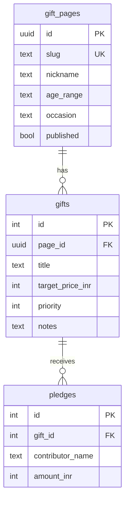

# Data model (Week 2)

```mermaid
erDiagram
  gift_pages ||--o{ gifts : has
  gifts ||--o{ pledges : receives
  gift_pages { uuid id PK
    text slug UK
    text nickname
    text age_range
    text occasion
    bool published }
  gifts { int id PK
    uuid page_id FK
    text title
    int target_price_inr
    int priority
    text notes }
  pledges { int id PK
    int gift_id FK
    text contributor_name
    int amount_inr }
```

Funding % for a gift = min(pledged / target x 100, 100).
